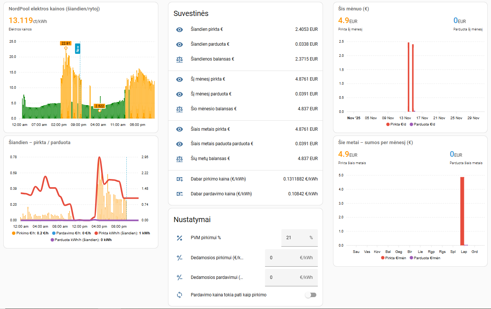

# Net Billing Statistics for Home Assistant



Šis projektas skirtas pateikti išsamią „net billing“ elektros apskaitą Home Assistant aplinkoje:  
pirkimo, pardavimo, grynosios kainos, energijos balanso, mėnesio ir metinių suvestinių bei vizualizacijų pagrindu naudojant „ApexCharts“.

## SVARBU!!! 
Tai dar ne galutinė versija ir gali būti taisytinų vietų.

---

## 🧩 Savybės

- Apskaičiuoja **realias elektros pirkimo ir pardavimo kainas**, pridedant:
  - NordPool kainą
  - PVM (reguliuojama)
  - dedamąsias pirkimui ir pardavimui (reguliuojama)

- Automatiškai apskaičiuoja:
  - **pirkimo ir pardavimo galią (kW)**
  - **importo ir eksporto energiją (kWh)**
  - **pirkimo ir pardavimo kainą per valandą (€/h)**
  - **bendrą kainą (EUR)**: dienos, mėnesio, metų

- Rodo **dienos**, **mėnesio** ir **metų** grafikus, įskaitant:
  - valandinį suvartojimą / gamybą
  - dienų stulpelius per mėnesį
  - mėnesių stulpelius per metus
  - bendras šių laikotarpių sumas

- Išskiriami:
  - pirkimo kaštai
  - pardavimo pajamos
  - grynasis balansas (import – eksport)
  - pirkimo/pardavimo santykiai

- Suderinama su visais energijos skaitikliais, kurie:
  - importą rodo su **minuso ženklu**
  - eksportą rodo **be minuso**

## Diegimas
Home Assistant reikalavimai:
 įdiegti [NordPool](https://www.home-assistant.io/integrations/nordpool/) integraciją.
 iš HACS įdiegti [apexcharts-card](https://github.com/RomRider/apexcharts-card) 
 NordPool kainų grafikui reikalingas templates.yaml, kuriame reikia dvejose vietose įrašyti savo `config_entry` reikšmes. Kaip gauti    `config_entry` reikšmes, rasite [čia:]([https://www.home-assistant.io/docs/tools/dev-tools/](https://www.creatingsmarthome.com/index.php/2025/09/12/home-assistant-migrating-to-the-official-nord-pool-integration/))

---

## 📁 Failų struktūra

Projekte pateikiami keturi pagrindiniai failai:
````
net-billing-statistics-ha/
├── 02_charging_prices.yaml # pagrindinis Home Assistant paketų failas
├── templates.yaml # NordPool kainų templat'ai (šiandien / rytoj / su PVM)
├── dashboard.yaml # Lovelace skydelio (Dashboard) kodas su visomis kortelėmis
├── Dashboard.png # pavyzdinė skydelio ekrano nuotrauka
└── README.md 
